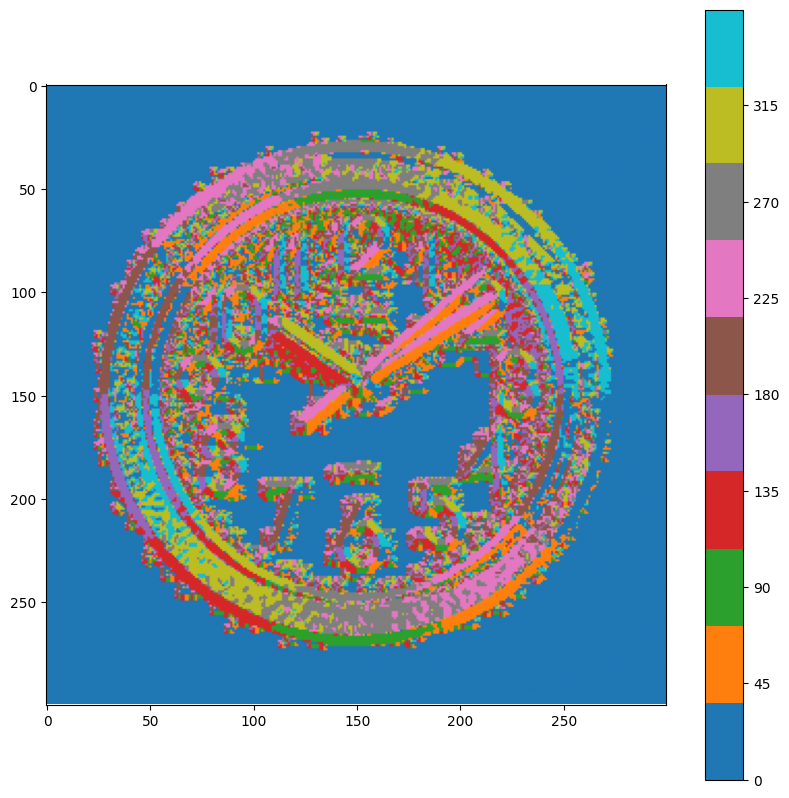

# Image Segmentation and Recognition: A Compendium

## Problem Statement and Goal of Project

This notebook implements and demonstrates a variety of foundational techniques in computer vision (CV) and machine learning (ML). The primary goal is to apply, benchmark, and compare different algorithms for tasks like image segmentation, object detection, and classification, showcasing practical implementation skills with libraries like OpenCV and Scikit-learn.

The focus is on demonstrating a clear understanding of *how* these models are implemented and function, rather than solely pursuing the highest possible evaluation metric.

## Solution Approach & Implementations

This project is a collection of distinct CV/ML experiments:

### 1\. Interactive Foreground Extraction (GrabCut)

  * **Approach:** Implements the GrabCut algorithm (`cv2.grabCut`) as described in the Microsoft Research paper.
  * **Process:** The algorithm interactively segments a foreground object from its background based on an initial user-defined bounding box. It iteratively refines a mask to achieve the separation.

### 2\. Handwritten Farsi Digit Classification (HODA Dataset)

  * **Approach:** This task benchmarks two different classifiers on the HODA dataset of handwritten Farsi digits.
  * **Process:**
    1.  **Data Loading:** The HODA dataset (60,000 training, 20,000 test images) is loaded from `.cdb` files using the `HodaDatasetReader` library.
    2.  **Preprocessing:** Images are flattened into 1D vectors and, in one experiment, standardized using `StandardScaler`.
    3.  **Model 1 (SVM):** A Support Vector Classifier (`sklearn.svm.SVC`) is trained on the flattened images.
    4.  **Model 2 (KNN):** A K-Nearest Neighbors classifier (`sklearn.neighbors.KNeighborsClassifier`) is trained and evaluated on the same data for comparison.
  * **Key Results:**
      * **SVM Accuracy:** 98.56%
      * **KNN Accuracy (Unscaled):** 97.82%
      * **KNN Accuracy (Scaled):** 96.00%

### 3\. Handwritten English Digit Classification (OpenCV)

  * **Approach:** Demonstrates an alternative method for data loading and classification, implementing KNN using OpenCV's internal ML module.
  * **Process:**
    1.  **Data Loading:** The dataset (`digits.png`) is a single image sprite (1000x2000 pixels) containing 5,000 handwritten digits (0-9). The code splits this sprite into 50 rows, treating the first 50 columns of each as training data and the latter 50 as test data.
    2.  **Model (OpenCV KNN):** A K-Nearest Neighbors model is created and trained using `cv2.ml.KNearest_create()`.
  * **Key Results:**
      * **OpenCV KNN Accuracy:** 91.76%

### 4\. English Alphabet Classification (UCI)

  * **Approach:** Applies the `cv2.ml.KNearest_create()` model to a different type of dataset from the UCI repository.
  * **Process:**
    1.  **Data Loading:** The "Letter Recognition" dataset is loaded from `letter-recognition.data`. This dataset consists of 20,000 samples, each with 16 statistical features (not raw pixels) extracted from letter images.
    2.  **Model (OpenCV KNN):** The KNN model is trained on 10,000 samples and tested on the remaining 10,000.
  * **Key Results:**
      * **OpenCV KNN Accuracy:** 93.06%

### 5\. Pedestrian Detection (HOG)

  * **Approach:** Implements the classic Histogram of Oriented Gradients (HOG) method for object detection, using OpenCV's built-in pre-trained model.
  * **Process:**
    1.  A `cv2.HOGDescriptor()` is initialized.
    2.  The default people detector SVM model (`cv2.HOGDescriptor_getDefaultPeopleDetector()`) is loaded.
    3.  The `detectMultiScale` function is run on a sample image (`people.jpg`) to identify bounding boxes for pedestrians.

### 6\. Real-Time Face & Eye Detection (Haar Cascades)

  * **Approach:** Demonstrates the use of Haar Cascade classifiers for real-time object detection from a webcam feed.
  * **Process:**
    1.  Pre-trained models for frontal face detection (`haarcascade_frontalface_alt.xml`) and eye detection (`haarcascade_eye_tree_eyeglasses.xml`) are loaded using `cv2.CascadeClassifier`.
    2.  A function (`detectAndDisplay`) is defined to find faces in a frame, and then search for eyes within each detected face region.
    3.  The script initializes a webcam feed using `cv2.VideoCapture(0)` and applies the detection function to each frame in a live loop.

-----

## Technologies & Libraries

  * **Python**
  * **OpenCV (`cv2`):** Used for GrabCut, HOG, Haar Cascades, OpenCV-native KNN, and general image processing.
  * **Scikit-learn (`sklearn`):** Used for SVM, KNN (comparison), and `StandardScaler`.
  * **NumPy:** For numerical operations and array manipulation.
  * **Matplotlib:** For displaying images and results within the notebook.
  * **HodaDatasetReader:** A specific library for loading the HODA Farsi digit dataset.
  * **Jupyter Notebook:** For interactive development and demonstration.

-----

## Description about Dataset

This project utilizes several different datasets to demonstrate various techniques:

1.  **Sample Images:** `akhavan.jpg` and `people.jpg` are used for the GrabCut, Haar Cascade, and HOG demonstrations.
2.  **HODA Dataset:** A large dataset of 102,353 handwritten Farsi digits, split into 60,000 training and 20,000 test samples for this project.
3.  **OpenCV Digits Sprite:** A `digits.png` image file (1000x2000) containing 50 rows of 100 digits each, used for the OpenCV KNN implementation.
4.  **UCI Letter Recognition:** A dataset of 20,000 samples where each "image" is represented by 16 statistical attributes (features) rather than raw pixels.

-----

## Installation & Execution Guide

1.  **Clone Repository:**

    ```bash
    git clone [repository-url]
    cd [repository-name]
    ```

2.  **Install Dependencies:**

    ```bash
    pip install opencv-python scikit-learn numpy matplotlib HodaDatasetReader
    ```

    *(Note: TensorFlow/Keras are imported but not required for the final models in this notebook.)*

3.  **Data:**

      * Ensure the sample images (`akhavan.jpg`, `people.jpg`, `digits.png`) are in the `images/` directory.
      * Ensure the Haar Cascade models (`.xml` files) are in the `models/` directory.
      * Download the HODA `.cdb` files and the `letter-recognition.data` file and place them in the `dataset/` directory, or update the paths in the notebook.

4.  **Execution:**

      * Run the `Image segmentation and recognition.ipynb` notebook using Jupyter Notebook or Jupyter Lab.
      * The final cell (Haar Cascade Face Detection) will attempt to access your system's default webcam (`cv2.VideoCapture(0)`).

-----

## Sample Outputs

  * **GrabCut Segmentation:** The notebook displays the original `akhavan.jpg` image with a green rectangle drawn around the subject, followed by the final output image showing only the segmented foreground (the person) against a black background.
  * **HOG Pedestrian Detection:** The notebook shows the `people.jpg` image with green bounding boxes drawn around the pedestrians identified by the HOG detector.
  * **Haar Cascade Detection:** The notebook displays the `akhavan.jpg` image with a green rectangle around the detected face and blue circles around the detected eyes.
  * **Digit Recognition:** A sample image of a handwritten Farsi digit (from the HODA set) is displayed using `matplotlib`.

-----

## Additional Learnings / Reflections

This notebook served as a practical exercise in applying and comparing fundamental CV and ML algorithms. Key takeaways include:

  * **Algorithm Benchmarking:** Directly compared the performance of SVM (98.56%) and KNN (97.82% / 96.00%) for the same digit classification task, demonstrating the high accuracy of both, with SVM showing a slight edge.
  * **Library Exploration:** Implemented the K-Nearest Neighbors algorithm using two different libraries (Scikit-learn and `cv2.ml`), providing insight into the different APIs and implementation details.
  * **Diverse Data Handling:** Gained experience loading and preprocessing data from various formats, including standard `.data` files (UCI), specialized `.cdb` files (HODA), and parsing image sprites (`digits.png`).
  * **Pre-trained vs. Trained Models:** Utilized both models trained from scratch (SVM/KNN) and powerful, pre-trained models (HOG/Haar Cascades) to solve different types of problems (classification vs. detection).
  * **Real-Time Application:** Extended static image analysis to a real-time video stream by integrating the Haar Cascade detector with `cv2.VideoCapture`, demonstrating a practical application of CV.

> 💡 *Some interactive outputs (e.g., plots, widgets) may not display correctly on GitHub. If so, please view this notebook via [nbviewer.org](https://nbviewer.org) for full rendering.*





## 🙏 Acknowledgments

This project represents my initial steps into the practical application of computer vision. The foundational knowledge and guidance for this work were derived from the outstanding OpenCV course taught by **Alireza Akhavanpour** on the **Maktabkhooneh** platform. His ability to deconstruct complex topics into clear, actionable steps was instrumental in the successful implementation of this project.
-----

## 👤 Author

### Mehran Asgari

### **Email:** [imehranasgari@gmail.com](mailto:imehranasgari@gmail.com).

### **GitHub:** [https://github.com/imehranasgari](https://github.com/imehranasgari).

-----

## 📄 License

This project is licensed under the Apache 2.0 License – see the `LICENSE` file for details.

-----

# ML-OpenCV-Segmentation-Recognition
